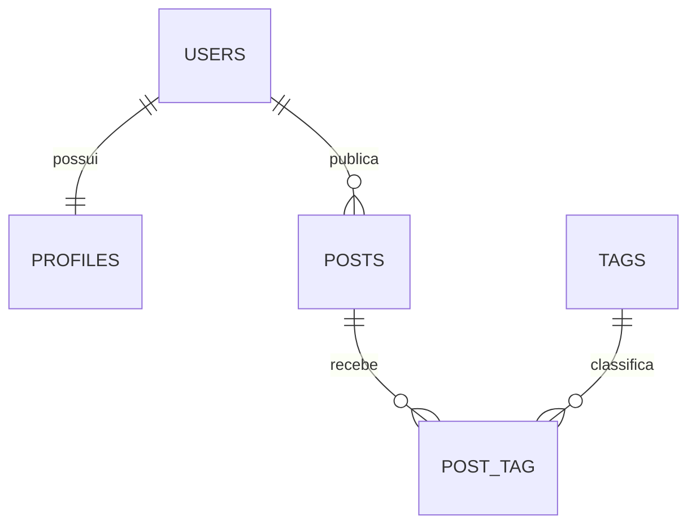

# Mapeamento Objeto-Relacional com Laravel

Projeto desenvolvido para demonstrar a criação de tabelas, chaves estrangeiras e relacionamentos utilizando Laravel, Eloquent ORM e MySQL.

## Tecnologias utilizadas

- PHP
- Laravel
- Eloquent ORM
- MySQL
- MySQL Workbench
- Composer

## Banco de dados

O projeto utiliza o banco:

```text
ams_laravel_db
```

## Relacionamentos

### Um para Um — 1:1

As tabelas `users` e `profiles` possuem relacionamento um para um.

Cada usuário pode possuir somente um perfil. A coluna `user_id` da tabela `profiles` possui chave estrangeira e restrição `UNIQUE`.

### Um para Muitos — 1:N

As tabelas `users` e `posts` possuem relacionamento um para muitos.

Um usuário pode criar vários posts, mas cada post pertence a somente um usuário.

### Muitos para Muitos — N:M

As tabelas `posts` e `tags` possuem relacionamento muitos para muitos.

Um post pode possuir várias tags e uma tag pode estar relacionada a vários posts. A ligação é realizada pela tabela pivô `post_tag`.

## Diagrama



## Principais tabelas

| Tabela | Finalidade |
|---|---|
| `users` | Armazena os usuários |
| `profiles` | Armazena os perfis dos usuários |
| `posts` | Armazena os posts publicados |
| `tags` | Armazena as tags |
| `post_tag` | Liga posts e tags |

## Criação das migrations

Os Models e as migrations foram criados utilizando o Artisan:

```bash
php artisan make:model Profile -m
php artisan make:model Post -m
php artisan make:model Tag -m
php artisan make:migration create_post_tag_table
```

## Executando o projeto

Configure o arquivo `.env`:

```env
DB_CONNECTION=mysql
DB_HOST=127.0.0.1
DB_PORT=3306
DB_DATABASE=ams_laravel_db
DB_USERNAME=root
DB_PASSWORD=
```

Execute as migrations:

```bash
php artisan migrate
```

Para inserir os dados de demonstração:

```bash
php artisan db:seed
```

## Dump do banco

O arquivo `database_schema.sql`, localizado na raiz do repositório, contém a estrutura SQL exportada diretamente do MySQL.

## Autor

Wallex André Adriano dos Santos